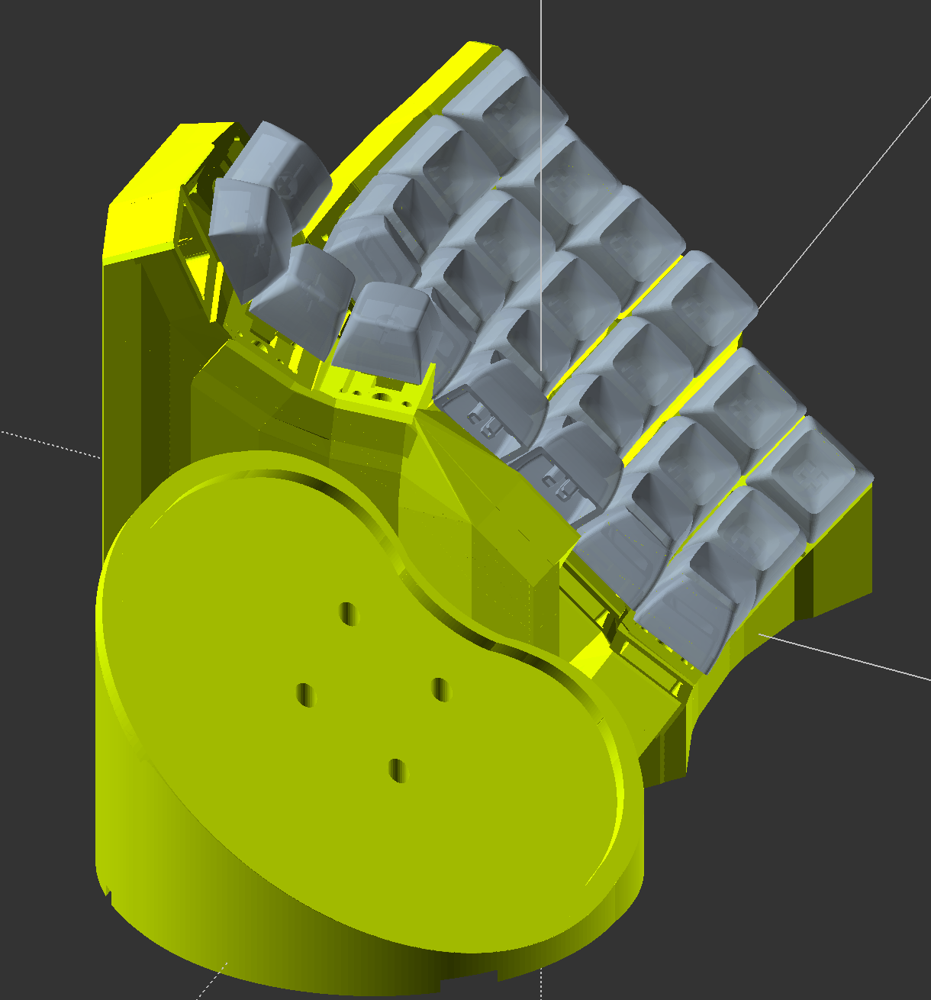
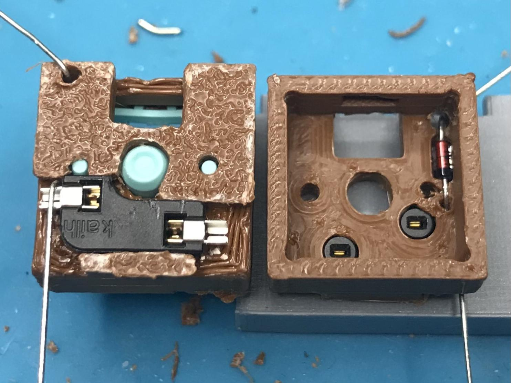
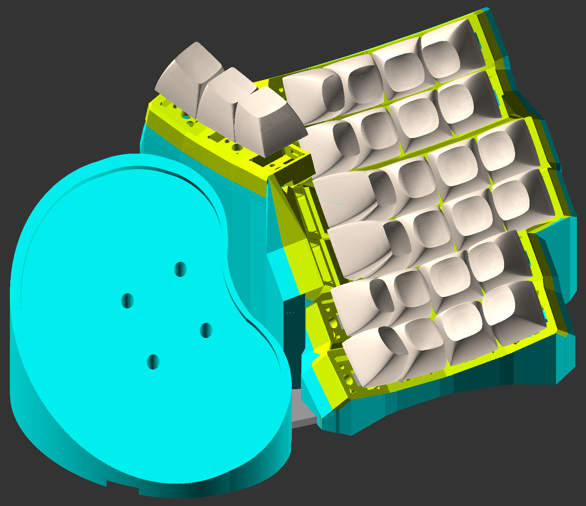
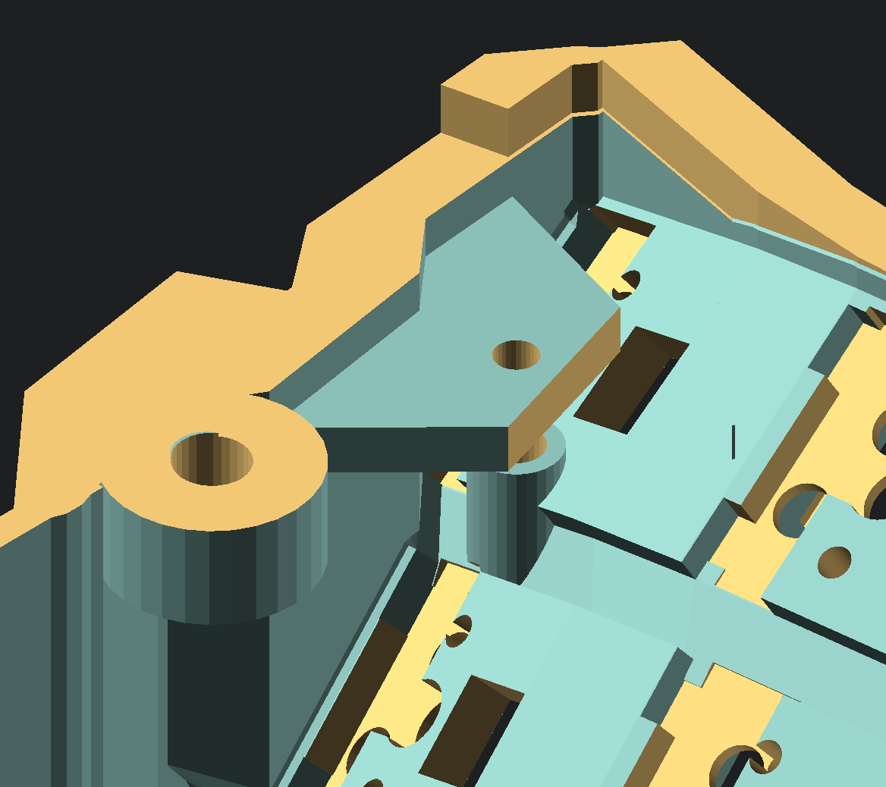

# Compactyl - A Compact Dactyl ManuForm Keyboard

This is a fork of the [okke fork](https://github.com/okke-formsma/dactyl-manuform-tight) of the [l4u fork](https://github.com/l4u/dactyl-manuform-mini-keyboard) of the [tshort fork](https://github.com/tshort/dactyl-keyboard) of the [Dactyl](https://github.com/adereth/dactyl-keyboard), a parameterized, split-hand, concave, columnar, ergonomic keyboard.

## Future TODOs
- TODO add ready to print risers with slots to increase palm rest height
- TODO confirm bastardkb mcu holder is compatible with blackpill version as well

## V6.0 (IN PROGRESS) Features
- adjust thumb height/angle and curvature

## V5.0 Features
- Added fourth thumb key
- Updated USB holder for bastardkb pcb mcu holder v1.4
- Rotated and adjust lower two keys further away along Y and Z to make compatible with taller keycap profiles on alpha
- Adjusted key heights to return to some of the design ideas I was trying out with [the dactyl hobbitform](https://github.com/dereknheiley/ibnuda.dactyl-keyboard) for small hands
	- Adjust column heights, ring finger lower on Z, middle and index columns higher on Z
	- Increase curvature of pinky column to bring bottom alpha and num row closer to finger
	- Add option to raise numrow slightly along Z axis
- Add option to support kailh, gateron, and outemu hot swap socket shapes. Tweak kailh cutout, and change to gateron version.

## V4.1 Features
- (Resin printing only recommended) Added optional for diode holder under switch for hotswap sockets. Holds the diode in an secure way so you can bend the wires around for easier soldering. Inspired by [Stingray](https://github.com/stingray127/handwirehotswap), [50an6xy06r6n](https://github.com/50an6xy06r6n/hotswap_pcb_generator) and [rmtz](https://www.reddit.com/r/MechanicalKeyboards/comments/7ueojw/my_na%C3%AFve_attempt_at_making_my_own_keyboard/) solderless sockets.

## V4.0 Features
- Cleaned up threaded insert holes for two-part case
- Raised thumb cluster and adjusted thumb cluster angle
- Added [DES "MT4"](https://github.com/dereknheiley/PseudoMakeMeKeyCapProfiles) rendered keycap preview with per-row profile and custom outer column keycaps
- Adjust tolerances around usb-holder to slide in more easily
- Lengthen USB holder for 35mm pro-micro-usb-c controllers
- Add more room for TRRS jack in USB holder
- Make vertical USB-holder easier to print with thicker "bottom"
- NOTE: you will probably have to increase OpenSCAD params:
	- Turn off rendering at ~10,000,000 
	- CGAL cache size ~8000mb
	- PolySet cache size ~8000mb

## V3.1 Features
- Added support for tilting outer index and pinky columns only
- Increased tent angle to 40 deg
- Adjusted case to remove jank around top index corner
- Changed to use vertical MCU holder
- Upsized top plate attachment screws from M2 to M3
- Modified case walls connecting to thumb
- Updated rendered thumb caps to rotated SA R1, which I use.

## V3.0 Features
- Added option for two part design per keyboard half
- Made a [watermelon keyboard](https://imgur.com/gallery/GW7DmTZ)

<!--  -->

## V2.1 Features
- Increased tent angle
	- Added global thumb angle adjustment
	- Adjusted case to still accommodate usb-holder with increased tent
- Reworked gel wrist rest holder to not distort at higher tenting angles
- Reinforced connection between columns with cutouts for connector / wiring clearance
- Added option to increase angle of lower two lower keys (inspired by rmtz Naive design)
- Added rendered option for keycap preview
- (Experimental) Added optional retention clip to assist with one-piece flexible PCB
- (Experimental) Added optional solderless socket option. Inspired by [Stingray](https://github.com/stingray127/handwirehotswap), [50an6xy06r6n](https://github.com/50an6xy06r6n/hotswap_pcb_generator) and [rmtz](https://www.reddit.com/r/MechanicalKeyboards/comments/7ueojw/my_na%C3%AFve_attempt_at_making_my_own_keyboard/) solderless sockets.
- NOTE: you will probably have to increase OpenSCAD params:
	- Turn off rendering at ~2,000,000 
	- CGAL cache size ~4000mb
	- PolySet cache size ~4000mb

## V2.0 Features
- Returned back to one solid piece top case deisgn for easier printing
- Subtraced space around keycaps to improve clearances
	- better clearance on top row for middle and ring finger keys
	- thick ABS caps still not recommended
- Adjusted stagger and column height deltas
- Extended bottom plate to connect wrist rest
	- Wrist rest can be positioned to adjust X, Y, or Z placement (adding or removing shims)
- Added modified version of cyrstalhands wrist rest holder
	- slanted, removed case connector tubes, added threaded insert holes

## V1.0 Features
- Hotswap north facing switch plates
- Increase pinky stagger
- Adjusted column spacing for better clearance
- Continuous (vs. recessed) bottom plate with filleted holes
- Exoskeleton top case design
- Rendered both 4x6 and 5x6 versions with bottom plate
- (orig. Tightyl) As small around the keys as possible
- (orig. Tightyl) Smoother transition between thumb and fingers (less facets)
- (orig. Tightyl) Thicker walls in steep regions where walls were too thin

## Update USB holder
- Created ("working" but unpolished) SCAD version of USB holder for modifications
- Provide better clearance to USB cables plugging into controller
- Adjust size to better hold Elite-C controller
- Taper angle to reduce waste material
- Make holder shape symetrical to case notches so it fits upside down or right side up
- Add option for square reset button to be held as well

## Wiring
- Uses typical COL2ROW diode direction and pins for dactyl manuform
- Should be backwards compatible with dactyl-manuform 5x6 firmware from
	- https://config.qmk.fm/#/handwired/dactyl_manuform/5x6/LAYOUT_5x6
	- https://github.com/Oh-Keycaps/firmwares#how-to-just-download-our-firmware

## Tools & Supplies [Full amazon wish list of equipment](https://www.amazon.ca/hz/wishlist/ls/18NL4T59KM4AE?ref_=wl_share)
- Soldering iron & stand, at least 50 watt
- No clean lead free solder in 21awg, or 25awg for smaller SMD components [lead solder is easier to flow, but be careful](https://www.wellpcb.com/lead-free-solder-vs-lead-solder.html)
- Silicone covered 26awg (0.405mm) wire
- Long tip gluegun, at least 60 watt

## Comparison with original Tightyl
- Orig. Tightyl (white) had more row curvature, and wider spaceing between columns
- New Compactyl (blue) uses a flatter row curvature, but increases tent to result in similar keyboard angle
- New Compactyl (blue) is approximately 4mm taller (plus additional heigh for bottom plate if used) because of space requried by hot swap holders below pinky columns.

## Generate OpenSCAD and STL models

**Setting up the Clojure environment**
* [Install the Clojure runtime](https://clojure.org)
* [Install the Leiningen project manager](http://leiningen.org/)
* [Install OpenSCAD](http://www.openscad.org/)

### Generating a Design
* Run `lein auto generate`
* This will regenerate the `things/*.scad` files whenever the .clr file is saved
* Use OpenSCAD to open a `.scad` file.
* Make changes to design in `src/dactyl_keyboard/dactyl.clj`, open scad files will auto regenerate, OpenSCAD will rerender.
* When done, use OpenSCAD to render, then export model STL files which can be printed by 3d printer slicing software.

### Batch (parallel) Processing
* Edit the path for OpenSCAD in `create-models.sh` if needed
* Change any other settings for which files you want to render
* Wait for STL files to appear (this may take a minute or two) 

## Tips

* I gave up trying to keep good values for both 4x6 and 5x6 options. So when adjusting the number of rows / cols, or tenting angles, (amoung other larger design changes) you will most likely have to update some magic numbers. I recommend opening the test.scad file and manipulate:
	* defn column-curvature 
	* defn centerrow
	* def centercol
	* defn column-offset
	* def keyboard-z-offset
	* def wrist-rest-z-height-adj
	* defn usb-holder-offset-coordinates
	* defn screw-insert-all-shapes
	* defn top-screw-insert-all-shapes
	* other magic numbers, collect them all :D
* When trying things out, 10 seconds of rendering time in OpenSCAD is really annoying. Load one of the test outputs with commented out parts that you aren't changing / don't use.
* If you're not sure what things are generted by a piece of code, color them in using something like
`(->> SOMETHING_HERE (color RED))` (see examples in dactyl.clj).

## License

Copyright © 2015-2022 Matthew Adereth, Tom Short, Leo Lou, Okke Formsma, Derek Nheiley

The source code for generating the models is distributed under the [GNU AFFERO GENERAL PUBLIC LICENSE Version 3](LICENSE).

The generated models are distributed under the [Creative Commons Attribution-ShareAlike 4.0 International (CC BY-SA 4.0)](LICENSE-models).
